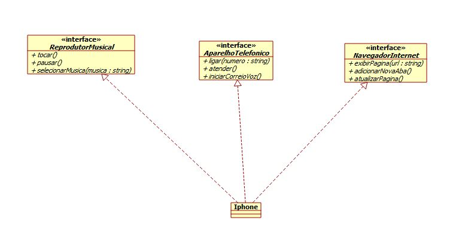

<h1> Desafio - Modelagem e Diagramação de um Componente iPhone</h1>

<h2> Contexto </h2>
Com base no vídeo de lançamento do iPhone de 2007, você deve elaborar a diagramação das classes e interfaces utilizando uma ferramenta UML de sua preferência. Em seguida, implemente as classes e interfaces no formato de arquivos .java.

<h2> Diagrama UML elaborado utilizando o software Umbrello: </h2>

